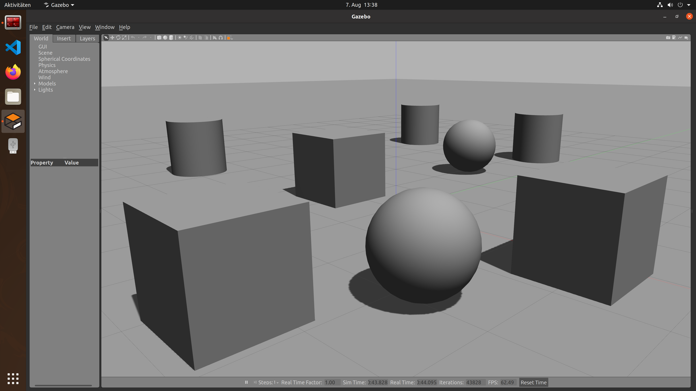
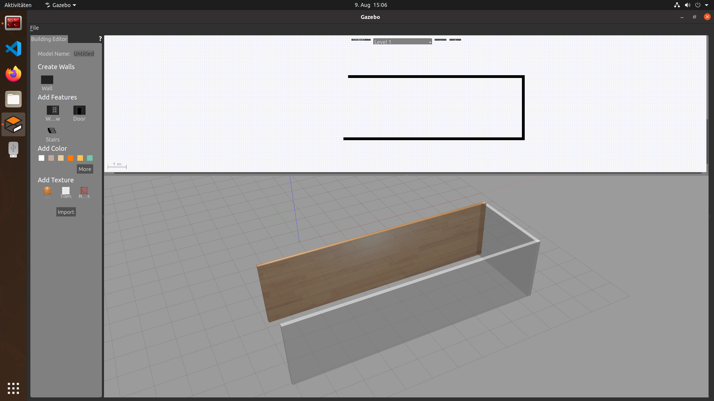
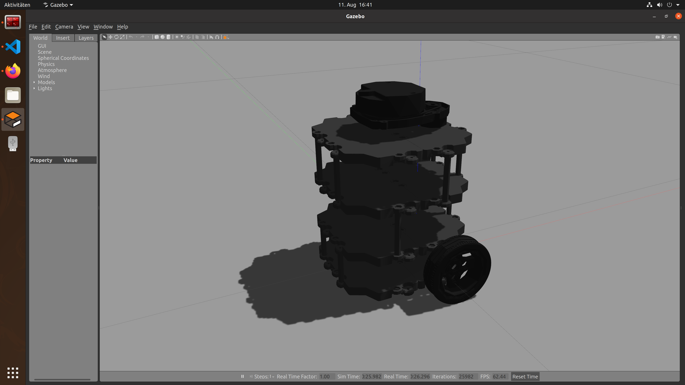
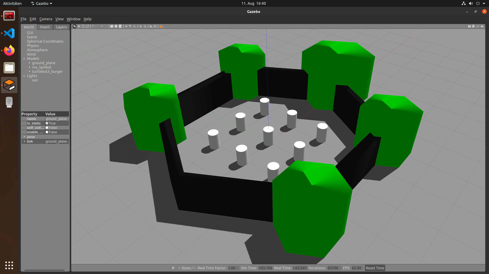
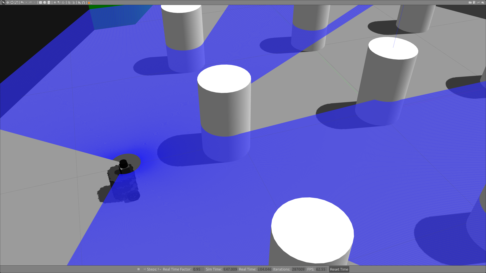
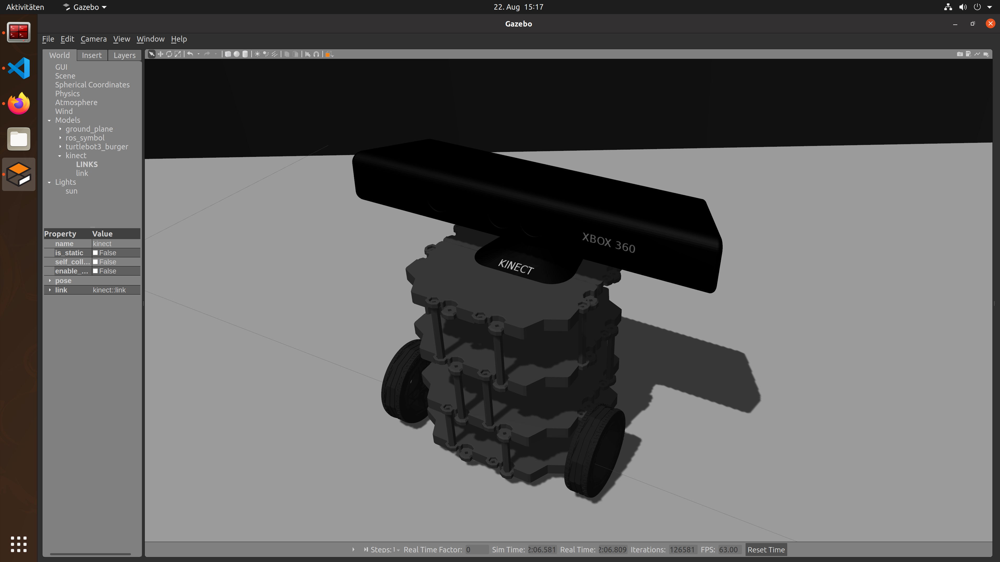
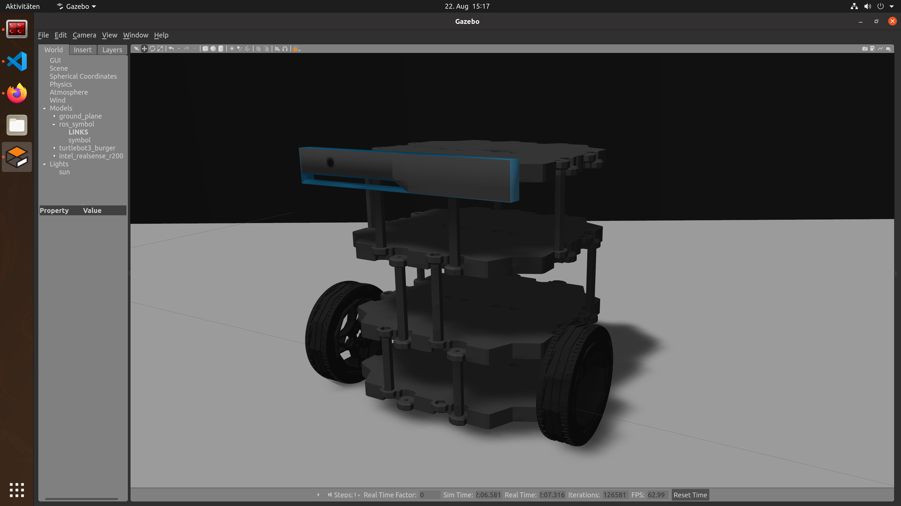

# Simulation of sensors in Gazebo
This repository is part of a bachelor thesis about the simulation of sensors using Gazebo.

## World editor
In Gazebo it is possible to create objets like cubes, cylinders or bullets. It's possible to combine them to complex objects.

## Wall editor
To test the navigation of robots in closed rooms, various scenarios can be created using the integrated wall editor.

## TurtleBot3
The TurtleBot3 is a mobile robot platform developed by ROBOTIS. This robot is optimal for education because of its flexibility in mounting sensors on it.

## TurtleWorld
The TurtleWorld is a predefined simulation environment with walls and objects. This world is perfect to test the usage of different sensors for navigation.

## Sensor simulation
In Gazebo it is possible to test sensors from different manufacturers. Due to the large community, there are already created 3D models for many different sensors.

### LiDAR
Gazebo can visualize the laser beams of LiDAR sensors to show how a robot can see it's environment. The collected data can used in ROS to navigate the robot.

### Microsoft Kinect and Intel Real Sense R200
The popular Microsoft Kinect and Intel RealsSense R200 cameras are aviable as 3D models for simulation. They can be used for depth measurements.

